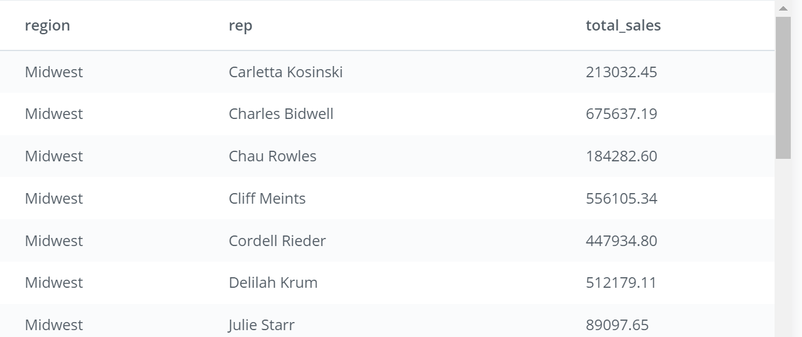
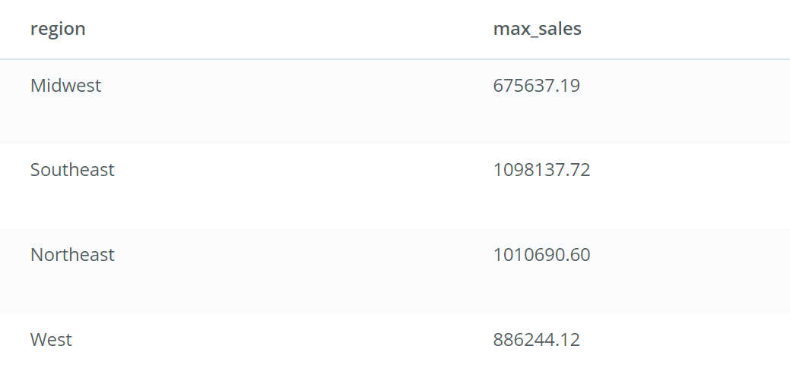
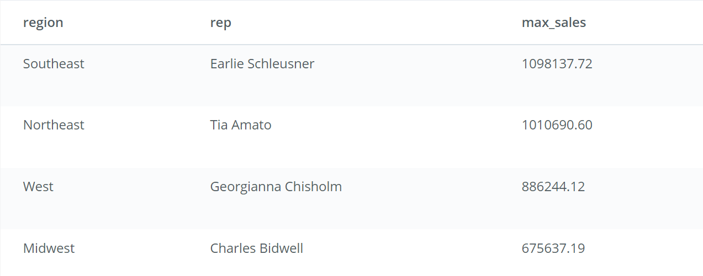

### Q1: Provide the name of the sales_rep in each region with the largest amount of total_amt_usd sales.

```sql
WITH t1 AS (
	SELECT r.name region, s.name rep, SUM(o.total_amt_usd) total_sales
	FROM region  r
	JOIN sales_reps s
	ON r.id=s.region_id
	JOIN accounts a
	ON s.id=a.sales_rep_id
	JOIN orders o
	ON a.id=o.account_id
	GROUP BY 1,2),

      t2 AS (
	SELECT region, MAX(total_sales) as max_sales
	FROM t1
	GROUP BY region)

SELECT t1.region, t1.rep, t2.max_sales
FROM t1
JOIN t2
ON t1.region=t2.region AND t1.total_sales=t2.max_sales
ORDER BY 3 DESC
```
#### approaching and breaking down the code
* First step would be to create a table containing regions , all their sales representatives, and their respective total sales.
 - the needed columns exist in three different tables so we need to join them first. Region and sales_reps  tables can be directly joined on region id. To join sales_reps with orders, we need to join first with accounts table. Since we'll be joining 4 tables, using a short alias for each one would make it easier to handle.
 ```sql
 FROM region  r
		JOIN sales_reps s
		ON r.id=s.region_id
		JOIN accounts a
		ON s.id=a.sales_rep_id
		JOIN orders o
		ON a.id=o.account_id
	 ```
 - now we can select region name, representative name and sum of all sales total_amt_usd. An important note here is that **we have to alias region name column and representative name column** because region and sales_reps tables both both have a column named 'name', we need to differentiate between them by a different alias name, otherwise the output will show only the first table column.
   ```sql
	SELECT r.name region, s.name rep, SUM(o.total_amt_usd) total_sales
	```
 - to get representatives and their respective total sales for each region, we need to group by region name then rep name as all non-aggregate columns need to be present in the group by clause. Writing  1 as the index of the region name column, followed by 2 as the index of rep name column would be easier than writing full names.
 ```sql
 GROUP BY 1,2
 ```
- we need to create a second table, so using WITH statement to define each table would save us much repetition of using subqueries.
lets create the first table t1.
```sql
WITH t1 AS (
	SELECT r.name region, s.name rep, SUM(o.total_amt_usd) total_sales
	FROM region  r
	JOIN sales_reps s
	ON r.id=s.region_id
	JOIN accounts a
	ON s.id=a.sales_rep_id
	JOIN orders o
	ON a.id=o.account_id
	GROUP BY 1,2)
	```
OUTPUT OF T1 IF EXECUTED AS A QUERY


*  A second table (t2) having just the distinct regions with their max total sales is required in order to join it with the previous table  (t1) on the max total sales **to get the sales rep name associated with that max amount of sales in each region** We will  query regions and  agggregate max sales from table1 that we already created, this should yield four regions with four max sales.
```sql
    t2 AS (
    SELECT region, MAX(total_sales) as max_sales
    FROM t1
    GROUP BY region)
```


* using With statement, it is easy to create the two tables, we then write a main query that joins both tables on total sales to get the three pieces of info we need, the region, the rep name, max sales .
To display the region and sales rep having largest amount of total sales first, we need to order by descending total sales, which has index 3.
```sql
SELECT t1.region, t1.rep, t2.max_sales
FROM t1
JOIN t2
ON t1.region=t2.region AND t1.total_sales=t2.max_sales
ORDER BY 3 DESC
```


